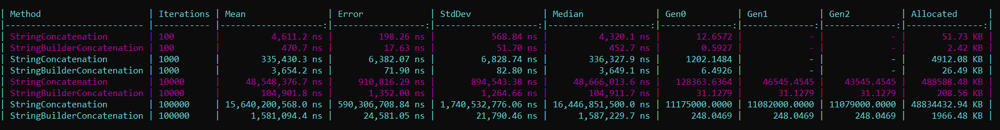

## Benchmark Results:

## 1. Which approach was faster with 100 iterations?

StringBuilder was faster than String Concatenation at 100 iterations.

## 2. Which approach was faster with 100,000 iterations?

StringBuilder was faster than String Concatenation at 100,000 iterations.

## 3. Which approach allocated more memory?

String Concatenation allocated more memory than StringBuilder.

## 4. What happened to String Concatenation performance as the loop size increased?

As the loop size increased, String Concatenation became slower, and the performance difference increased gradually.

## 5. Why does repeated String Concatenation create additional allocations?

Because strings in C# are immutable. Every time a string is modified through concatenation, a new string object is created instead of changing the existing one, which causes additional memory allocations.

## 6. Why does StringBuilder usually perform better when text is repeatedly appended?

StringBuilder is mutable, so repeated appends modify its internal buffer instead of creating a new string object after every append. This usually reduces memory allocations and improves performance.

## 7. Is StringBuilder always better than normal string operations? Explain.

No. Normal string operations are suitable for simple or small concatenations. StringBuilder is more useful when many additions or modifications are performed repeatedly, especially inside a loop. It can reduce memory allocations and improve performance, and the final result can be converted back to a string using ToString().